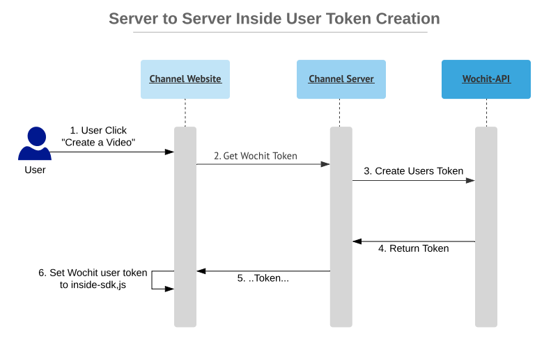

# Multi Account Setup

Here you will learn how to effectively manage multiple customers under your primary account. Our API provides the flexibility and control you need to manage and authenticate individual users specifically for a certain customer. Leverage this feature to create a more organized, secure, and efficient management system across all your customer base.

## API Usage

You will receive an API key and your channel ID. These can also be procured from the following link: <a href="https://admin.wochit.com/developers/integration-setup">https://admin.wochit.com/developers/integration-setup</a>. It's worth noting that these headers must be included in every API call you make.

### Common Headers:

```json
{
	"Content-Type": "application/json",
	"channel-id": <channel-id>,
	"Authorization": "Bearer <API-key>"
}
```

| Property   | Type   | Values | Description     |
| ---------- | ------ | ------ | --------------- |
| channel-id | Number |        | Your channel ID |
| API-key    | String |        | Your secret key |

Remember to keep your API keys secret; treat them just like passwords! They act on your behalf when interacting with the API. Do not share your personal API keys with anyone outside your organization. Don’t hard-code them into your programs; instead, opt to use them as environment variables. Please contact our <a href="mailto: support@wochit.com?subject=Revoke API key">support</a> if you’re concerned your API key has been compromised.

## Retrieve Channel Information

You can retrieve data about your channel (like available template categories)
in order to properly adjust your customer's settings & experience:

**GET https://studio-api.wochit.com/api/v1/channels/{channelId}**

Response:

```json
{
  "templateCategories": [
    {
      "id": "1",
      "name": "Shopping"
    },
    {
      "id": "2",
      "name": "Blogging"
    }
  ]
}
```

## Create New Customer

Below is the detailed API for creating a new customer entity in the Wochit platform:

**POST https://studio-api.wochit.com/api/v1/customers**

Payload:

```json
{
    "name": <customer's name>,
    "organization": {
        "partnerId": <unique-customer-identifier>
    },
    "adminUserRequestModel": {
        "firstName": <contact-person's-first-name>,
        "lastName": <contact-person's-last-name>,
        "email": <contact-person's-email>,
        "phone": <contact-person's-phone>
    },
    "templateCategoryIds":[
      <list of template category IDs>,
    ]
}
```

| Property                        | Type   | Values        | Description                                                                                                        |
| ------------------------------- | ------ | ------------- | ------------------------------------------------------------------------------------------------------------------ | --- |
| name                            | String |               | _(Required Unique)_ customer's name                                                                                |
| organization.partnerId          | String |               | _(Required Unique)_ Your customer's unique ID                                                                      |
| adminUserRequestModel.firstName | String |               | _(Optional)_ The contact person's first name                                                                       |
| adminUserRequestModel.lastName  | String |               | _(Optional)_ The contact person's last name                                                                        |
| adminUserRequestModel.email     | String |               | _(Optional)_ The contact person's email                                                                            |
| adminUserRequestModel.phone     | String |               | _(Optional)_ The contact person's phone number                                                                     |     |
| templateCategoryIds             | Array  | ["1","2","3"] | _(Optional)_ Limit customers template selection to specific categories (obtained by the channel information route) |

Response:

```json
200 OK
{
  "organizationId": <Wochit-organization-id>
}
```

```json
401 Unauthorized
400 Bad Request
500 Internal Server Error
```

| Property       | Type   | Values | Description              |
| -------------- | ------ | ------ | ------------------------ |
| organizationId | Number |        | Wochit's organization ID |

## Update Existing Customer

Below is the detailed API for updating an existing customer entity in the Wochit platform:
As of the PATCH HTTP method, every field that will be sent in the request will result in an update of that fiels in the Customer entity, otherwise, if the field will not be sent - it will not be updated.
If a 'null' value will be sent - the field will be deleted.

**PATCH https://studio-api.wochit.com/api/v1/customers**

Payload:

```json
{
  "organization": {
    "partnerId": <unique-customer-identifier>
  },
  "fieldsUpdates": {
    "templateCategoryIds": [
      <list of template category IDs>,
    ]
  }
}
```

| Property                           | Type   | Values        | Description                                                                                                        |
| ---------------------------------- | ------ | ------------- | ------------------------------------------------------------------------------------------------------------------ |
| organization.partnerId             | String |               | _(Required Unique)_ Your customer's unique ID                                                                      |
| fieldsUpdates.hostedMedia.provider | Number | 1             | _(Optional)_ Contact to Wochit support for more information                                                        |
| fieldsUpdates.templateCategoryIds  | Array  | ["1","2","3"] | _(Optional)_ Limit customers template selection to specific categories (obtained by the channel information route) |

Response:

```json
202 Accepted
401 Unauthorized
400 Bad Request
500 Internal Server Error
```

## User Authentication

Below is the detailed API for authenticating a user entity in the Wochit platform.
Authentication is done by calling the Wochit API. During the authentication process new user entity will be created in Wochit in case this user does not exist yet and a token will be created to authenticate this user in future calls.



1. Channel user clicks on "Create a video" button
2. Channel client request from channel server Wochit Inside User Token
3. Channel server will make http POST request to Wochit authentication service
4. Wochit server will return the user token
5. Channel server will return to Channel client the Wochit Inside User Token
6. Channel client set the Wochit Inside User Token to inside-sdk.js

**POST https://authentication.wochit.com/api/v1/embedded/users/tokens**

### Headers:

```json
{
	"Content-Type": "application/json",
	"client-id": <channel-id>,
	"Authorization": "Bearer <API-key>"
}
```

### Payload:

```json
{
  "user": {
    "id": <user's-unique-identifier>,
    "email": <user's-email>,
    "firstName": <user's-first-name>,
    "lastName": <user's-last-name>
  },
  "organization": {
    "partnerId": <unique-customer-identifier>
  }
}
```

#### Request Properties

| Property               | Type   | Values | Description                                     |
| ---------------------- | ------ | ------ | ----------------------------------------------- |
| user.id                | String |        | _(Required Unique)_ Your unique user identifier |
| email                  | String |        | _(Optional)_ The user's email                   |
| firstName              | String |        | _(Optional)_ The user's first name              |
| lastName               | String |        | _(Optional)_ The user's last name               |
| organization.partnerId | String |        | _(Required Unique)_ Your customer's unique ID   |

Response:

```json
{
"token":
    {
	"value":  <token-value>,
	"expirationDate": <token-expiration-date>
    }
}
```

| Property       | Type   | Values | Description                                                                     |
| -------------- | ------ | ------ | ------------------------------------------------------------------------------- |
| value          | String |        | The end user token, this will be used by the wochit js module for every request |
| expirationDate | Number |        | The end user token expiration time in milliseconds                              |
